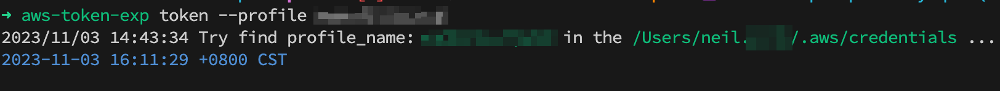
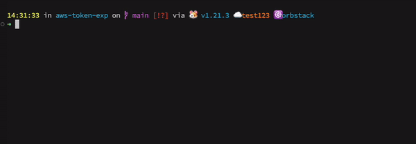

# Install
### For Linux users

```bash
$ curl -fsSL https://github.com/neilkuan/aws-token-exp/releases/latest/download/aws-token-exp-Linux-$(uname -m).tar.gz -o - | tar zxvf -
$ mv ./aws-token-exp /usr/local/bin/aws-token-exp
```

### For macOS users

```bash
$ curl -fsSL https://github.com/neilkuan/aws-token-exp/releases/latest/download/aws-token-exp-Darwin-$(uname -m).tar.gz -o - | tar zxvf -
$ mv ./aws-token-exp /usr/local/bin/aws-token-exp
```

## Build Arch 
```bash
GOOS=linux GOARCH=arm64 go build .

GOOS=linux GOARCH=amd64 go build .

GOOS=darwin GOARCH=arm64 go build .

GOOS=darwin GOARCH=amd64 go build .
```

## To use 
```bash
# use profile
aws-token-exp token --profile aad-xxx
2023/11/03 14:43:34 Try find profile_name: aad-xxx in the /Users/neil.xxx/.aws/credentials ...
2023-11-03 16:11:29 +0800 CST


# Use AWS_PROFILE env.
AWS_PROFILE=aad-xxx; aws-token-exp token
2023/11/03 14:43:34 Try find profile_name: aad-xxx in the /Users/neil.xxx/.aws/credentials ...
2023-11-03 16:11:29 +0800 CST
```



## `pc` profile change
```bash
curl -o ~/pc.sh https://raw.githubusercontent.com/neilkuan/aws-token-exp/main/pc.sh

source ~/pc.sh
```

### alias in to `~/.zshrc` or `~/.bashrc`
```bash
curl -o ~/pc.sh https://raw.githubusercontent.com/neilkuan/aws-token-exp/main/pc.sh

echo 'alias pc="source pc.sh"' >> ~/.zshrc
```

### fish
`vim ~/.config/fish/functions/pc.fish`
```vim
#!/opt/homebrew/bin/fish
function pc
    aws-token-exp pc
    set -l file_path "/tmp/shared_env.txt"
    if test -f $file_path
            set -l key (cat $file_path | cut -d '=' -f 1)
            set -l value (cat $file_path | cut -d '=' -f 2)
            set -x $key "$value"
        echo "Environment var1iables set from $file_path"
    else
        echo "File $file_path not found."
    end
    
    aws-azure-login --profile $AWS_PROFILE --disable-gpu
end


```





# License

[Apache-2.0](LICENSE)
